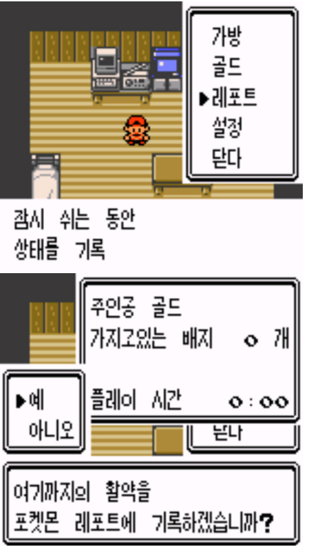
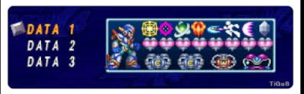
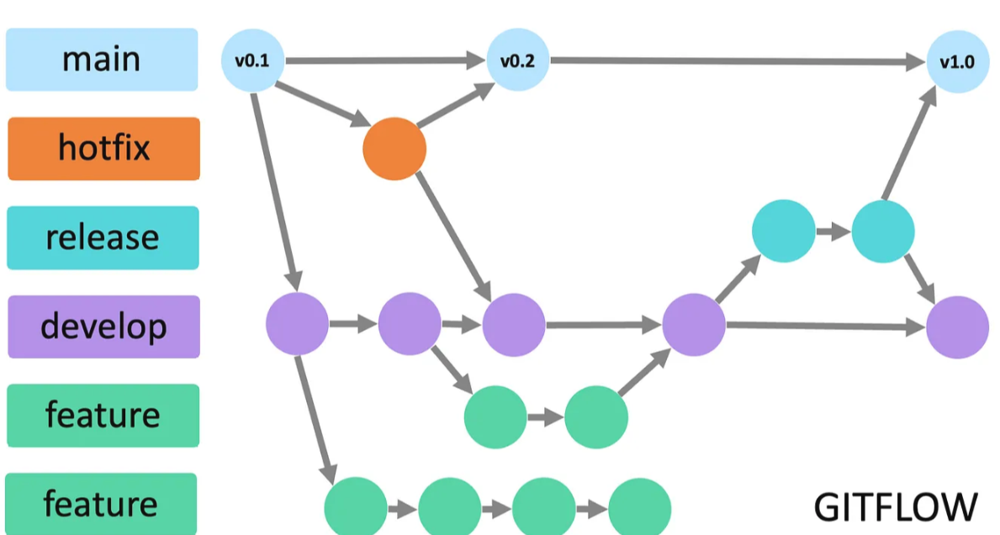

# Git 개념과 사용법 

<br>
<br>
<br>
<br>
<br>
<br>
<br>
<div style="text-align: right;">by:연구 3팀 전인준 연구원</div>

 
---
# 목차
- 용어 
- 개요
- 개념
- 사용법
 - 사용시나리오 
 - 충돌 해결

---
# 용어

clone
repository 
- .git 
- git init
- .gitignore 파일

commit  / branch (local remote) 
pull / push
git flow 
로컬 <-> 원격
pull 로컬 <- 원격
push 로컬 -> 원격 


커밋
브랜치
- checkout


---
## 개요
|   | {} |
|:--:|:--:|

---

# 개요 
- 형상관리 툴
    - 최종보고서_진짜최종_수정.docx  
    - 최종보고서_진짜최종_수정_20260115.docx
- 모든 걸 저장한다.(삭제라는 개념이 없음! -> 없어졌다는 저장을 함)
    - (언제 무엇을) (누가 / 왜) 
    - (커밋내용)    (커밋메시지)
---

<!-- _class: columns -->
<div>

# 개념

| **구분** | **로컬 (내 PC)** | **원격 (서버)** |
|:--:|:--:|:--:|
| 커밋 | 개인 작업 이력 | 공유된 이력 |
| 브랜치 | 작업용 브랜치 | 공유 브랜치 |


커밋(점) : (커밋내용 + 커밋 메시지) == 저장기록(스냅샷)
브랜치(선) : 커밋들이 모인것 

서버 : github,gitlab
- ip 따라서 개인 로컬 pc가 서버가 될 수도 있음 


---
# 브랜치 관리 요령 : git flow


---

# 동작순서
- git 설정( git init vs git clone) 
- 작업
- 로컬 저장 (커밋 생성 == 브랜치에 커밋추가)
- 서버 저장 (원격 저장소와 연결 / pull && push) 

---

clone 
branch 를 가져옴
가져온 branch 에 commit 을 추가 

init 
branch 생성
커밋 생성 
서버에 branch를 저장 


---

# 권장 시나리오
```
1. gitlab 에서 repository 생성 
    - 저장소 이름 확인 

2. git clone 

3. 작업 
    - readme
    - gitignore 
        - git에 올리고 싶지 않은 것 설정  
4. 커밋 

5. pull && push 
    - 서버에 올리기전 pull하고 push 하는 습관 
```
---
# 충돌 해결
충돌이란? 
서버와 로컬의 내용이 다를 경우! 
줄(line)을 기준으로 비교 


---

# Todo
- git fork, pull request
- git repo

사용사나리오
고과평가
구구단 프로그램 
점검장비 프로그램 
여행 일지 