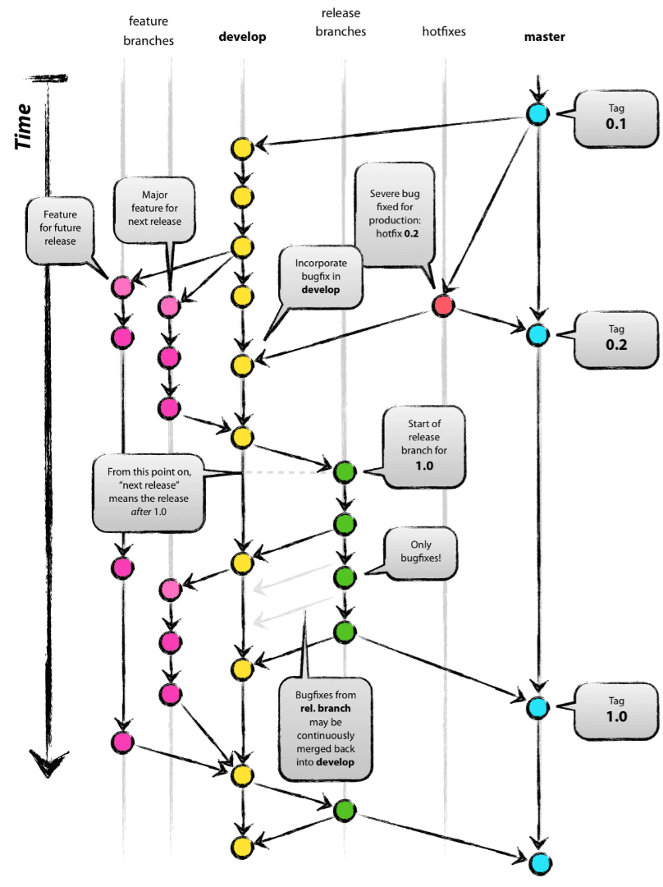

- 여러 개발자들이 동시에 다양한 작업을 할 수 있게 만들어주는 기능으로, 각자 독립적인 작업 영역(저장소) 안에서 마음대로 소스 코드를 변경할 수 있는 Git의 기능

브랜치는 프로젝트의 가상복사본
프로젝트안의프로젝트 
저장소에서 일어나는어떤일과도 상관없이 자유롭게 커밋 가능 

브랜치는 결국커밋들의 스택

진행하면서 어떤 방해 없이 변경작업을 할 수있는 안전한 장소 

git은 새 브랜치를만들고 브랜치를 이동시키는것 구분함
-b 옵션으로 해결
git checkout -b 

## 병합 

대부분 궁극적으로 마스터 사본에 합치기 위한 의도로 브랜치 이용 

병합 둘이상의 서로다른브랜치를 양쪽특성을 모두 갖는 하나의 통합된 버전으로 합치는 작업 

현재 브랜치에 다른 브랜치의 모든 사항을 포함해 완료하고 싶다면 두가지 조건이 필요
1. 다른 브랜치에서 만든커밋이 비록순서변동이있을지라도 커밋로그에서 모두 보여야함 
기본적으로 현재 위치까지 오게 한 히스토리가 필요 지금까지 모든 작업을 포함하는 계보를 두 브랜치를 통해 거슬러 올라갈수있어야함 
두 브랜치의 모든 변경사항이 결합된 프로젝트 파일과 폴더 사본이 최종적으로 필요하다는점

병합한 이후의  커밋도 예외는아님 어떤사람 또는 어떤 것이 새롭게 통합된 프로젝트 버전을 구성하는 책임을 져야함 

# 전략
## 패스트포워드

빠른전진 
한쪽만 수정사항이 있는경우 수정사항이없는 현재커밋을 다른브랜치의 헤드 커밋으로 이동시키는것
단순히 같은 -ㅓ밋을 가르키게 되며 이름만빼고 모든사항 동일하게됨

# 병합커밋
git 은 먼저 두 버전의 가장 최근 공통 조상을 찾아 각 브랜치의 헤드 -ㅓ밋의 변경 여부를 식별 이를 기준점으로 변경된 내용과 순서를파악 
두브랜치의 각자변경된 내용을 기준점의 내용과비교 
둘 중한 브랜치에 변경된 한 라인이있으면 그줄은 최종병합사본으로의 포함을위해 이전 
두브랜치가 같은 라인에 대한 각자의 변경사항을 갖고 있지 안는한 gitㅡㅇㄴ 모든 사함을 자동으로 병합 
병합된 스냅샹이 자동으로생성되면 병합했다는생성메시지와함께 일을 마무리 짓고 -ㅓ밋 

git merge -no-commit 은 병합된버전 만들어 스테이징 커밋 하지않음 
직접 커밋메시지 만들고 싶은 경우

변경사항을차례로 병합해 마ㅈ막에 단 한번만 커밋하고 싶을때 
 - 작업량을 절약할수없고 병합커밋으로 표시됨으로 얻을 수 있는 이득포기해야함 

## 병합커밋의 특성
하나의 부모커밋만 가지는 보통의 커밋과 달리 병합커밋은 둘 이상의 부모(보통은 둘)를 가질 수 있음 
대부분병합커밋은 다른커밋과 유사하며 동일한규칙을 준수  

topic 브랜치를 마스터의 마지막버전으로부터 너무 멀리 떨어지지 않게 하는게 좋음 

이상적으로 각 토픽 브랜치는 자신의 주제와 관련해선 master와 달라야함
상관없는 변경사항이나 master의 예전버전으로 회귀하는 어떤 사항도 가지면 안됨

## 병합 충돌 다루기 
어떻게 병합해야 맞는지 사용자에게 도움 요청 
병합커밋도 커밋임
두 부모를가져 두 개의 이전 버전을 합해 하나의 통합된 버전을 만든다는 것외에 다른커밋과 동일한 규칙과 절차를 따름 
포함하고자하는변경사항을 스테이징하고 다음에 커밋하는 것 마찬가지 

git은 동일한 파일의 두 사본을 자동으로 병합하지 못할ㄸ대 작업사본에표시하고 둘중 맞는 버전을 수동선택하라고 요청 

충돌마커 conflict maker 표식을 넣음 
사용자 충돌이 표시된 부분을 병합되기 원하는 버전으로 일일이 교체 

꺽쇠 괄호가 연속으로 있는 라인이 충돌마커

충돌 마커 사이가 충돌영역 
충돌영역상단 head로 식별할수있는 현재 브랜치의 파일버전을보여줌 

head
- 브랜치 헤드포인트에 대한 git의이름
- 특정브랜치의 가장 상위에 있는 커밋 에대한별칭
- 작업사본에 현재 체크아웃돼있는커밋과 같ㅡㅇㄴ 의미 

충돌영역하단
병합하고자하는버전을 보여줌

병합
하나살리기
둘다 살리기
둘다지우기 

master와 자주병합하여 충돌예방

git의 이름만특정 브랜치의 가장상위에 있는커밋에 대한별칭 
작업사본에 현제 체크아웃돼 잇는 커밋 
충돌영역 하단 병합하고자 하는 버전 을 master라는이름으로 보여줌

하나씩 확인하며 병합된 버전을 만드는일은 전적으로 인간사용자에게 달림 

git은 사용자가 그 내용을 모두 알고 있을것이며 직접 충돌을 없앨수 있을거라 믿음 

마스터 브랜치와 토픽 브랜치 서로를 최신으로 유지하는 목적
- 충돌 방지보다 차이최소로 유지하여 충돌 쉽게 관리하는 데 있음

충들의 해법은 commit 언제나 

git 은 기본적으로 오프라인에서 운영 
홀로 수행하는 프로젝트라면 어떤 서버에 접근필요없고 어떤계점도 만들필요없이 강력한 버전관리혜택을 누릴수있다는 의미 

그레이스 호퍼
버그라는단어 만듬
항구에 있는 배는 안전 
배는그러려고 만든게 아님

# 리모트 브랜치
데이터를 교환할 수 있는 실제 물리적인사본

한 컴퓨터의 브랜치로부터 커밋을 다른 컴퓨터의 브랜치로 직접 푸시할수있고 반대도 가능 
허브 모델을 통해 코드공유 
- 팀원은 자신의 로컬카피를 서로의 사본이 아닌 중앙의 공유사본과 동기화 

# 리모트 저장소
내 컴퓨터가 아닌 원격에 있는 git 프로젝트사본 
- 네트워크안다른컴퓨터 
다른어딘가에있는 누군가의컴퓨터 
github등 온라인서비스 

git을 통해 다른 폴더에 두번째 사본만들어 리모트 저장소라고여겨도 

remote는 가장 성공적인 추상화 가운데 하나 
리모트 데이터를교환할수있는 실제 물리적인사본에 해당 

## 브랜치 종류

# branch 구분

master 최신
4.1.4.2 버전 이전버전유지 

develop 브런치 

브랜치의 이름 자신의 존재 이유를 논리적으로 설명할 수 있어야함 
커밋과달리 브랜치는 완전히 삭제 가능
브랜치 목록이 사용하는공간은커밋로그보다 큼 

- master : 제품으로 출시될 수 있는 브랜치
- develop : 다음 출시 버전을 개발하는 브랜치
- feature : 기능을 개발하는 브랜치
- release : 이번 출시 버전을 준비하는 브랜치
- hotfix : 출시 버전에서 발생한 버그를 수정 하는 브랜치

## hotfix branch

배포한 버전에 긴급하게 수정을 해야 할 필요가 있을 경우, ‘master’ 브랜치에서 분기하는 브랜치

‘develop’ 브랜치에서 문제가 되는 부분을 수정하여 배포 가능한 버전을 만들기에는 시간도 많이 소요되고 안정성을 보장하기도 어려우므로 바로 배포가 가능한 ‘master’ 브랜치에서 직접 브랜치를 만들어 필요한 부분만을 수정한 후 다시 ‘master’브랜치에 병합하여 이를 배포해야 하는 것이다.

배포한 버전에 긴급하게 수정을 해야 할 필요가 있을 경우,
‘master’ 브랜치에서 hotfix 브랜치를 분기한다. (‘hotfix’ 브랜치만 master에서 바로 딸 수 있다.)
문제가 되는 부분만을 빠르게 수정한다.
다시 ‘master’ 브랜치에 병합(merge)하여 이를 안정적으로 다시 배포한다.
새로운 버전 이름으로 태그를 매긴다.
hotfix 브랜치에서의 변경 사항은 ‘develop’ 브랜치에도 병합(merge)한다.

# 관리

체크인(Check-In)

- 체크아웃 한 파일의 수정을 완료한 후 저장소의 파일을 새로운 버전으로 갱신

체크아웃(Check-Out) :

- 프로그램을 수정하기 위해 저장소에서 파일을 받아 옴
- 소스 파일과 함께 버전 관리를 위한 파일들도 받음

## 이름변경

Local Branch(로컬 브랜치) 이름 변경 방법
git checkout <old_name_branch>
git branch -m <new_name_branch>

Remote Branch(원격 브랜치) 이름 변경 방법
git push origin -u <new_name_branch>

- push 하고자 하는 branch 에 checkout 하신 후에 새로운 이름의 브랜치로 push

git push origin --delete <old_name_branch>
- 필요없는 예전 이름의 브랜치를 --delete 옵션을 통해 삭제

# git branch 관리

C#

- 특수문자 경로 삭제

# Merge

- branch를 통합하는 것이고,
- default, no fast forward

# Rebase

- merge 되었다는 전제하에
- merge 가 되어 있지 않으면 최종 merge 이후 작업한 내용은 날아감

cherry pick 보다 rebase 가 보기 좋음

git rebase를 사용하여 커밋을 결합시키고 브랜치 기록을 수정합니다.
git rebase -i를 사용하면 기록 수정 시 표준 git rebase보다 훨씬 정밀한 제어가 가능합니다.

이전 또는 여러 개의 커밋을 수정하기 위해 git rebase를 사용하여 커밋 시퀀스를 새로운 기본 커밋에 결합시킬

rebase 도중 편집 또는 e 명령이 해당 커밋에서 rebase 재생을 일시 중지하고 git commit --amend를 사용하여 추가로 변경할 수 있도록 합니다. Git는 재생을 중단하고 다음과 같은 메시지를 표시합니다.

- branch의 base를 옮긴다는 개념의 차이가 있습니다.

rebase는 사전 의미와 같이 base를 재설정한다는 의미 입니다.

여기서 말하는 base는 branch의 base를 의미 합니다.

branch는 base 지점을 가지고 있어 base에서부터 코드를 수정합니다.

git history를 살펴보면 branch의 base가 어디 있는지 확인 할 수 있습니다.

- B 지점을 base로 가진 branch가 D, E 커밋을 진행 한다.
- C 지점으로 base를 이동하기 위해 branch에서 C 지점으로 rebase를 한다.
- C 지점으로 rebase 되면 기존 D, E 커밋은 새롭게 정렬되어 C 지점 이후로 변경된다.

위 그림 그대로 C 지점으로 base를 옮기고 기존에 있던 Commit을 재정렬

Git History가 상당히 깔끔해짐 -개발자가 여러명이라도 순서대로 commit 한 것과 같은 git history를 만들 수 있음

# merge vs rebase

두개의 개념의 차이는 확실히 다름

## 공통점

Rebase와 Merge를 사용

- commit 내용들이 이쁘게 정렬됨?

## Merge만 사용

- 최종결과 물만 merge한 브랜치에 반영 그 히스토리들이 너저분해짐

# Rebase와 Merge를 사용
- commit 내용들이 이쁘게 정렬됨?

# Rebase

커밋이 불필요하게 여러 개로 나뉘어져 있으면 squash 진행

- 커밋 2개 합쳐야 하는 경우

작업 브랜치를 upstream/feature-user에 rebase함

작업 브랜치를 origin에 push

# 사용

작업을 할 때 브랜치의 수명은 되도록 짧게 가져가는 게 좋지만, feature 브랜치에서 기능을 완료하는데 해야 할 작업들이 많아서 오래 걸리는 경우 들이 있습니다. 그러다 보면 develop에 추가된 기능들이 필요한 경우가 종종 생기게 됩니다. 그럴 때는 feature 브랜치에 develop의 변경사항들을 가져와야 합니다.

1. feature-user 브랜치에 upstream/develop 브랜치를 merge 합니다.
    
    > (feature-user)]$ git fetch upstream(feature-user)]$ git merge –no-ff upstream/develop
    > 
2. upstream/develop의 변경사항이 merge된 feature-user를 upstream에 push 합니다.
    
    > (feature-user)]$ git push upstream feature-user

# 유의

hotfix는 master에서 만들기 

release는 마스터에서 그어야쟤

git branch생성

git checkout -b test

git push origin test
이렇게되면 local과 저장소의 remote branch가 생성됩니다.
생성된 branch는 각자가 local 및 저장소 기준이므로, local의 branch를 retmoe branch와 연동하는 작업을 수행하는 것이 좋습니다.
branch 연동은 다음을 통해 수행합니

git branch --set-upstream-to origin/feature-01

branch 삭제하기
작업이 끝나고, 기준 branch로 pull request가 종료되어서 merge까지 완료 되었다면, 해당 branch를 삭제 해줍니다.
merge 작업이 끝난 local의 feature-01 branch를 삭제하기 위해서는, 다른 branch로 checkout 후, feature-01 branch를 삭제해 주어야 합니다.
여기서는 develop branch로 이동해서 feature-01 branch를 삭제해 보겠습니다.

git checkout develop
git branch --delete feature-01
그러나, 작업된 사항이나 commit 한 이력이 남아있는 경우, 해당 command로 branch가 삭제되지 않는 경우가 있습니다.
이러한 경우에는 강제로 branch를 삭제할 수 있습니다.

git branch -D feature-01
-D(대문자) option을 통해서 local branch를 강제로 삭제할 수 있습니다.

이 경우, local의 branch는 삭제 되었으나, remote branch는 삭제가 아직 되지 않았습니다. remote branch를 삭제하기 위해서는, 다음과 같은 command를 수행합니다.

git push origin :feature-01
해당 command를 통해서 원격 remote branch를 삭제할 수 있습니다.

git checkout master ~1

- 1단계 전 커밋 해당하는 숫자만큼 과거로

특 정 커밋 돌아가기
git checkout 고유번호

git merge B
B를 현재 브랜치로 병합 한다

git log -- branches --graph --decorate -- oneline

충돌 
merge 과정에서 파일의 이름이 같으면 충돌이 발생한다.
파일이 다르면 무조건 자동으로 합쳐준다.
파일이 같아도 수정한 부분이 다르다면 자동으로 합쳐준다. (버전관리를 사용하는 정말 중요한 이유중의 하나)

git status 
- 충돌이 일어난 파일을 찾을 수 있음

충돌 발생한 파일 수정

코드를 병합한 후 특수기호들 제거 
- <<<<<<<HEAD // 현재 checkout 한 브랜치 상태
======= //구분자
>>>>>>> exp //병합하려는 exp의 브랜치 상태

수정후 add,commit 진행하면 정상적으로 mergecommit 진행 

git branch
앞에 * 는 현재 브런치를 의미함 

git branch -v
- 브랜치 마다 마지막 커밋 메시지도 함께 보여줌

git branch --merged ,--no-merged
- 이미 merge한 브랜치 목록 확인

git branch -d 
- 아직 merge하지 않은 커밋을 담고 있으면 삭제되지 않음
	

git large file
git lfs- plugin

