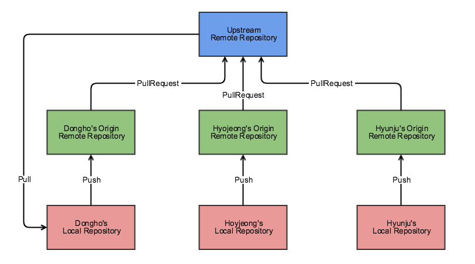

- 최신 버전의 파일들과 변경 내역에 대한 정보들이 저장되어 있는 곳
- 형상(버전)관리에서 사용하는 용어로써, 관리 대상을 형상관리 시스템으로 일괄 전송하여 압축, 암호화한 후에 파일의 현재 버전과 변경 이력 정보를 저장하는 저장소를 뜻하는 용어
- 관리 대상을 형상관리 시스템으로 일괄 전송하여 압축, 암호화한 후에 파일의 현재 버전과 변경 이력 정보를 저장하는 저장소

## Git Repository 구성

Upstream Repository

- 개발자들이 공유하는 저장소로 최신 소스코드가 저장되어 있는 원격 저장소입니다.

Origin Repository는 Upstream Repository

- Fork한 원격 개인 저장소입니다.

Local Repository

- 내 컴퓨터에 저장되어 있는 개인 저장소입니다.