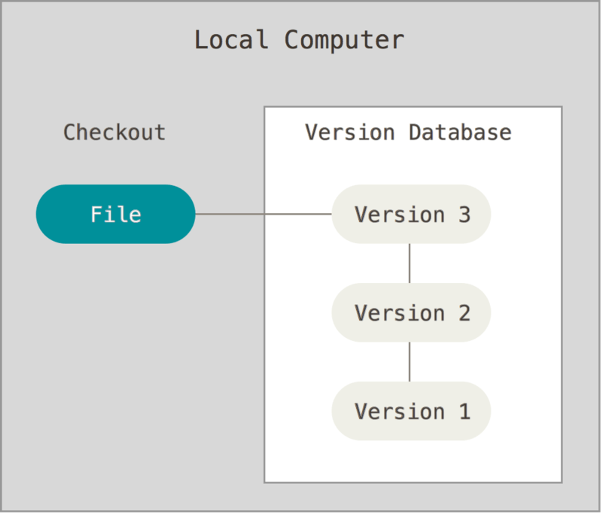
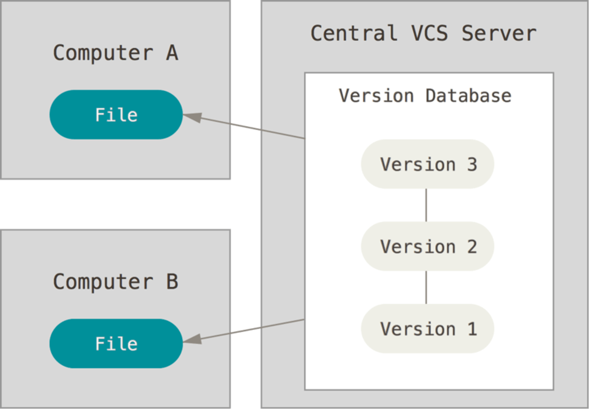

# 작업사본 
변경사항을 저장소에 저장하기 위해 안전하게 변경할 수 있는 하나의 프로젝트 버전
- 어떤변경도 원하는대로 할 수 있으며 특정 변경사항을 저장소에 커밋하면 공식적으로 저장되는 버전 

# 버전
어떤 측면에서 볼 때 동일 유형의 시간의 변화(순차적, 반복적 )에 따른 형태를 나타내거나 혹은 다른 어떤방식으로 이전형태나 다른 형태로 부터 구분되는 특정한 형태

주어진 관점에서 다른복사본들과무언가다르거나 변경이된 복사본을의미 

# 버전관리
- 지속적으로 수행할 때 최상의 역할을 함 
- 커밋했다면 당시의 정확히 동일한 상태를 나중에 다시 찾을 수 있다는 믿음 
- 버전을저장하는것이상으로 필요한 규칙과 프로세스를 포괄 

# 버전구별방식
솟자방식 v12
날짜스탬프 12-12-22

기초 활용
- 프로젝트 디렉터리 통째로 복사해 날짜나 순번을 붙여 버전번호로 사용하는 방법

예시
- versions/v12 

시스템의 신뢰를 유지하기 위해선 항상 정확히 동일한 방법으로 규칙이 지켜져야함

같은 파일을 동시에 두 사람이 작업해야 하는 상황이란 한 사람의 작업이 나머지 사람의 작업을 덮어쓰는위험감수
- 클로버링 clobbering 
 - 해결 
  - 잘협력
  - 자동으로변경

기존 체크아웃한 사람 변경작업완료하고 체크인하기전까지 파일편집할수없게 
- 체크아웃한 사람이 작업끝내기 전까지 다른사람은 기다려야함 

# 버전관리의 문제 
두 개의 작업 사본을하나의 버전으로 합치는것 
- 변경사항 충돌을 해결하기 위한 파일 검토는 즐겁지 않은일

파일 수가 많은경우 
공동 작업자가 많은경우 

규칙준수
저장소 안의 과거 버전추적

저장소와 작업사본사이의 변경사항 전달 
두 디렉터리 병합
충돌 감시 

서로 다른 컴퓨터 사이의 동기화에 탁월 

중앙 허브를 통해 다른 작업자의 사본을 내려받거나 진행사항을 확인하거나 자신의 변경사항을 올릴 수 있고 git을 사용해 변경사항을 웹서버에 배포할 수 있음 

## **VCS**

- **Version Control System** 의 약자로 이름 그대로 **버전 관리를 도와주는 시스템**이다.
- **파일의 변화를 시간에 따라 기록했다가 나중에 특정 시점의 버전을 불러올 수 있는 시스템**을 의미한다.
- 선택한 파일을 이전 상태로 되돌릴 수 있고, 변경 사항을 비교하고, 변경한 사람 및 변경 시기를 추적할 수 있다.

# 종류

## Local VCS
        

- 단순하게 데이터베이스를 사용해서 파일의 변경 정보를 관리하는 시스템이다.
- 가장 단순한 구조이며 **파일을 다른 디렉토리에 복사**하는 방식이다.
- 오류가 발생하기 쉽고, 어떤 디렉토리에 있는지 잊어버리거나 실수로 잘못된 파일에 쓰거나 복사하기 쉽다.
- RCS (Revision control system) 이 대표적

## CVCS

- Centralized VCS 는 여러 사람과 함께 작업하면서 생기는 문제를 해결하기 위해서 개발되었다.
 **서버가 별도로 존재하고 클라이언트가 중앙 서버에서 파일을 받아서 사용**하는 방식이다.
- Local VCS 보다 관리가 쉽다는 장점이 있지만 중앙 서버에 문제가 발생하면 치명적이라는 문제가 있다.
- **CVS**, **Subversion**, **Perforce** 가 대표적

## DVCS

        
 - **Distributed VCS** 는 클라이언트가 단순하게 파일의 마지막 스냅샷을 이용하는 것이 아닌 **전체 기록을 포함한 저장소를 완전히 미러링** 하는 방식이다.
 - 이런 방식을 통해서 서버가 중단거나 문제가 있을 경우 **클라이언트 저장소를 서버에 복사하여 복원**할 수 있다.
 - 많은 클라이언트들이 리모트 저장소를 가질 수 있기 때문에 **다양한 방법의 협업이 지원**
 -  git, **Mecurial**, **Bazaar**, **Darcs** 가 대표적이다.

- [.git 내부 구조 파헤치기](https://tecoble.techcourse.co.kr/post/2021-07-08-dot-git/)
    
- [git의 기본 파일 단위인 blob 과 hashing 의 관계에 대해 알아보자](https://kotlinworld.com/300)
    
- [Content-addressable storage](https://en.wikipedia.org/wiki/Content-addressable_storage)
    
- [버전관리 시스템이란?](https://yoongrammer.tistory.com/17)
    
- [git 버전 관리 정보](https://git-scm.com/book/en/v2/Getting-Started-About-Version-Control)
    
- [시작하기 - Git 기초](https://maintainhoon.vercel.app/blog/post/git_internal_behavior)
    
- [Git의 기초 - 수정하고 저장소에 저장하기](https://git-scm.com/book/ko/v2/Git%EC%9D%98-%EA%B8%B0%EC%B4%88-%EC%88%98%EC%A0%95%ED%95%98%EA%B3%A0-%EC%A0%80%EC%9E%A5%EC%86%8C%EC%97%90-%EC%A0%80%EC%9E%A5%ED%95%98%EA%B8%B0)

# 그외

폴더를 공유하거나 이전 버전의 파일을 확인하고 복원할 수 있는 드롭박스

파일 동기화 시스템

영화 해커스