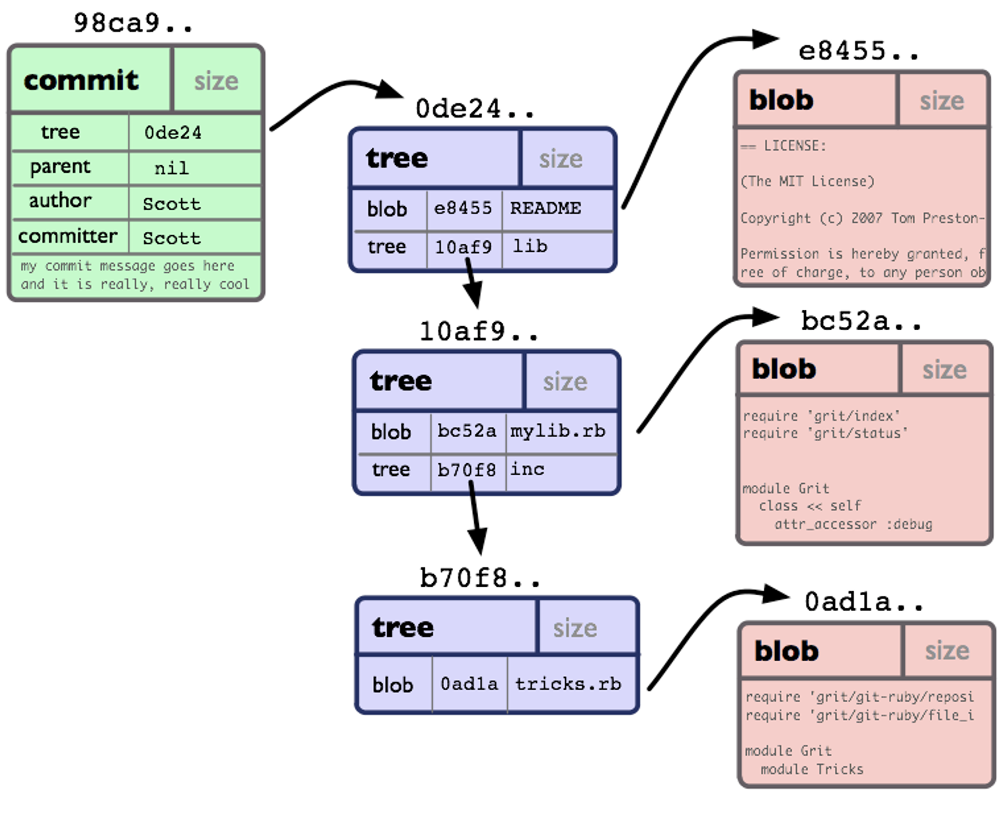

중앙집중형시스템
모든 버전의 히스토리에 접근할 수 있는 유일한 장소가 공유된 원격공간 
작업사본에의접근은 오프라인에서만가능 

프로젝트의 전체 히스토리에 해당하는 완전한사본이 모든컴퓨터에 존재 

# 구조
- Git 은 **Content-Addressable** 파일 시스템이고 그 위에 **VCS** 인터페이스가 있는 구조
-  git 은 **DVCS 방식**을 사용
 

# 정보 저장 방법

## **Content-Addressable Storage**

이름이나 위치가 아닌 **내용을 기반**으로 검색할 수 있도록 정보를 저장하는 방법이다.
- **해시 기능**을 통해 파일의 콘텐츠를 전달하여 **고유 키인 콘텐츠 주소를 생성**하는 방식이다.
- 단순하게 말하면 **git 이 Key-Value 구조의 단순한 데이터 저장구조**를 가지고 있다는 것이다. 
- 이는 **.git/objects 디렉토리**를 확인해보면 알 수 있다.
    - **objects 디렉토리**는 **git 의 모든 변경사항을 압축해서 파일들을 폴더 내부에 저장**한다.
    - 내부에 저장된 정보로는 **commit**, **tree**, **blob** 등이 존재하고 위 3가지가 핵심이다.
    - 아래 이미지를 먼저 확인하고 각 내용을 확인하면 대략적인 동작을 이해하기 쉽다.
        
        
        

  

# blob
 **Binary Large Object** 로 일종의 **불변 객체**이자 **파일 객체**이다.
- **SHA-1 체크섬**을 이용해서 파일 내용을 식별 가능하다.
- **다양한 파일의 데이터를 저장** 가능하고, 파일의 메타 데이터를 제외한 **순수 데이터 자체만**을 저장한다.
- 소스 코드, 이미지 등 다양한 파일의 데이터를 저장한다. 파일의 메타 데이터를 저장하지 않고 데이터 자체만을 저장한다. (파일명과 같은 메타데이터는 저장되지 않음) 그렇기 때문에, 동일한 소스 코드를 가진 파일이 여러 개 있더라도 하나의 blob 파일만 생

소스 코드, 이미지 등 다양한 파일의 데이터를 저장한다. 파일의 메타 데이터를 저장하지 않고 데이터 자체만을 저장한다. (파일명과 같은 메타데이터는 저장되지 않음) 그렇기 때문에, 동일한 소스 코드를 가진 파일이 여러 개 있더라도 하나의 blob 파일만 생성된다.

# **tree**
        - git 이 **폴더 구조를 지원하는** 방법이다.
        - 내부에는 **파일 식별자**, **파일 데이터의 해시 값**, **파일의 이름**이 저장되어있다.
        - tree 는 **blob** 과 **서브 tree** 로 구성된다.
        - 폴더 구조를 git에서도 관리해주는 것이 tree 파일이다. Blob에는 실제 파일의 데이터들이 저장되는 것과는 다르게, tree에는 파일 식별자, 파일 데이터의 해시값, 파일의 이름이 저장된다. 폴더가 파일과 폴더로 구성되는 것처럼, tree는 blob 과 또 다른 tree로 구성된다. 파일 식별자는 100644(읽기 파일(blob)), 100755(실행 파일(blob)), 040000(디렉터리(tree)) 세 가지로만 구성
        -- 타입 : "tree" 타입

- 사이즈 : 트리 오브젝트의 용량을 bytes로 표시

- tree 객체 : 하위 디렉토리의 트리 객체를 재귀적으로 참조할 수 있다.

- blob 객체 : 한 디렉토리에 있는 모든 blob을 담고 있다.

객체에 대한 접근권한, 파일이름은 여기서 관리한다

  

- git commit 은 '스냅 샷'에 자주 비유
- 여럿이서 찍은 사진을 보면 그 순간의 모든 상황들이 그려지는 것처럼
- 커밋하는 순간에 스테이지에 있던 작업파일들의 ID뿐 아니라 실제 파일이름, 어느 디렉토리에 속하는지 같은 전체 관계도가 담겨 있음
폴더 구조를 git에서도 관리해주는 것이 tree 파일이다. Blob에는 실제 파일의 데이터들이 저장되는 것과는 다르게, tree에는 파일 식별자, 파일 데이터의 해시값, 파일의 이름이 저장된다. 폴더가 파일과 폴더로 구성되는 것처럼, tree는 blob 과 또 다른 tree로 구성된다. 파일 식별자는 100644(읽기 파일(blob)), 100755(실행 파일(blob)), 040000(디렉터리(tree)) 세 가지로만 구성된다.

커밋을 진행했을 때, 자동으로 파일 시스템 모드(권한 관련 설정)가 수정되는 chmod 644, chmod 755 명령어가 실행된 경험이 있을 것이다. 이는 git에서 지원하는 파일 시스템 모드가 100644, 100755 두 가지 뿐이기 때문이다.

위 파일을 보면, git으로 관리되고 있는 폴더는 읽기 파일 a,b,c, 실행 파일 d, 그리고 dir 폴더를 가지고 있다. a,b,c,d의 해시값이 같은 것으로 보아 파일의 내용은 모두 동일하다. (실제 네 개 모두 아무 값도 없는 empty 파일이다)

# commit

- 각각의 commit 별로 하나의 commit 파일로 저장된다.
- 내부에는 **가장 최신의 tree 해시 값**, **부모 commit 에 대한 참조**, **commit 메시지** 등이 저장된다.
- 일종의 **불변 객체**이다.
- 각각의 커밋별로 하나의 커밋 파일로 저장된다. 
- git으로 관리되는 가장 바깥 tree의 해시값, author, commiter, 커밋 메시지의 정보가 저장이 된다.
- parent에는 직전 커밋의 해시값이 저장되어, Linked List의 형태로 커밋들이 구성된다.- 커밋을 진행했을 때, 자동으로 파일 시스템 모드(권한 관련 설정)가 수정되는 `chmod 644`, `chmod 755` 명령어가 실행된 경험이 있을 것이다. 
	        - 이는 git에서 지원하는 파일 시스템 모드가 100644, 100755 두 가지 뿐이기 때문이다.
    
- 작성자

- 커밋 실행자

- 커밋 날짜

- 로그 메시지

- tree

- 객체 : 해당 커밋에서의 dir/file의 상태를 알 수 있다.

- index를 바탕으로 사진을 한 장 찍어서 트리구슬을 하나 만든
- 구슬에 대한 커밋구슬을 만듬

  

commit_gistory

각각의 커밋별로 하나의 커밋 파일로 저장된다. git으로 관리되는 가장 바깥 tree의 해시값, author, commiter, 커밋 메시지의 정보가 저장이 된다.
parent에는 직전 커밋의 해시값이 저장되어, Linked List의 형태로 커밋들이 구성

# tag
- 객체종류
- 태그이름
- tagger
- 태그메시지
- PGP 서명정보

# **git의 명령어의 작동 이해하기**
        
        1. `git fetch`
        
        `git fetch`란 명령어는 원격저장소의 데이터를 가져온다. 이 때 objects와 refs의 변화를 생각해 보면 다음과 같다.
        
        objects: 파일의 데이터가 같은 경우를 제외한 다른 blob/tree/commit 정보들이 추가된다.
        
        refs: 새로 생긴 remotes의 branch들을 추가하고, commit이 된 경우에는 각 브랜치 별로 최신 커밋으로 참조값을 수정해줘야 한다.
        
        1. `git reset`
        
        강력하면서도 자주 사용하는 명령어가 reset이다. `git reset`이 실행되면, 현재 HEAD가 가르키고 있는 브랜치의 커밋 해시값이 reset 위치의 커밋의 해시값으로 수정된다.
        
        **그렇다면 reset을 한 경우 복원이 가능할까?** 정답은 “가능하다”이다. git은 reset을 하는 그 시점에 objects의 파일을 삭제하지 않는다.(가비지 컬렉션의 방식으로 데이터가 많아졌을 때, 참조값이 없는 것의 삭제를 진행한다)
        
        친절하게도 `git reset`을 진행했을 때 `ORIG_HEAD`라는 파일이 생성되어, reset 하기 전 커밋의 해시값을 따로 저장해둔다. 그렇기 때문에 `git reset --hard ORIG_HEAD`를 통해서 reset을 복구할 수 있다. 물론 직접 기존 커밋의 해시값으로 reset을 해도 마찬가지로 동작한다.
        
        ---
        
        ### **정리**
        
        git이 작동하는 원리를 직접 .git 내부를 보며 확인해봤다. 직접 git 프로젝트를 만들어 도전해보기를 바란다. 상당히 재미있다.

# HEAD
- HEAD는 현재 로컬 저장소가 가르키고 있는 브랜치를 참조한다.
- 특정 브랜치가 아닌 특정 커밋으로 checkout하면 detach가 됐다는 메시지가 뜬 기억이 있을 것이다. 이때는 그 브랜치를 참조하는 것이 아니라, 커밋의 해시값이 HEAD에 들어가게 된다.

  

# index

  

index_gistory

  

index파일은 stage에 있는 파일들이다. 즉, git add를 진행하면 index의 파일이 수정된다. git은 index와 마지막 커밋을 비교하여 커밋할 파일이 있는지 판단한다. 또한 index와 현재 파일을 비교하여 수정된 파일이 있는지 여부도 확인한다.

# objects

objects의 구성은 실제 파일에 담긴 값들을 SHA1 해시한 값 40자 중 2자는 폴더명 38자는 파일명으로 두어 식별자로 활용한다. 해싱을 사용했을 때, 소스 코드의 일부만을 바꾸더라도 별개의 해시값이 되기 때문에, 파일 식별이 쉬워지게 된다. (추가로 SHA1 해시 처리 전, zlib으로 한번의 압축이 진행된다.)

# logs

HEAD, 각각의 브랜치 별로 작업 목록이 로그로 기록된다. gistory로 확인해보길 바란다.

# hooks

git에서 지원하는 기본적인 hook들이 정의되어 있다. .sample을 지우면 샘플이 적용되는데, 이 글에서는 각 hook에 대해서는 설명하지 않는다.