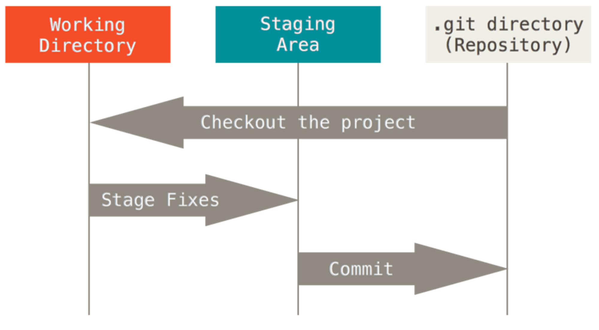
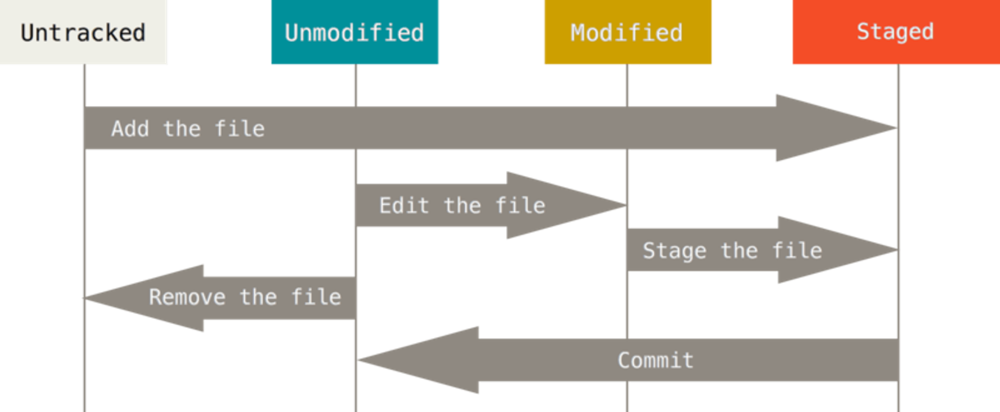

- 디렉토리에 있는 파일은 크게 **Tracked** 와 **Untracked** 로 나뉘고 Tracked 파일은 이미 **snapshot** 에 포함되어 있는 파일이다.
    - 여기서 **snapshot** 이란 git 이 데이터를 바라보는 관점으로 파일을 하나씩 별도로 보는 것이 아닌 프로젝트 전체를 관리하는 형태이다.
    - 말 그대로 **프로젝트 전체를 사진을 찍어서 관리하는 느낌**으로 변경이 이루어지면 **가장 최신 버전의 snapshot 만 통째로 저장하고 나머지 commit 들에 대해서는 snapshot 끼리의 차이인 delta 를 저장**한다. 이러한 방법으로 인해 git 이 작은 용량으로 빠르게 동작한다.
    - 디렉토리에 있는 파일은 위와 같이 분할되지만 git 의 프로젝트는 세 가지 상태로 관리한다.
        - **Committed**: 데이터가 로컬 데이터베이스에 안전하게 저장됐다는 것을 의미한다.
        - **Modified**: 수정한 파일을 아직 로컬 데이터베이스에 commit 하지 않은 것을 한다.
        - **Staged**: 수정한 파일을 곧 commit 할 것이라고 표시한 상태를 말한다.

- Tracked 파일은 또 **Unmodified**(수정하지 않음)와 **Modified**(수정함) 그리고 **Staged**(commit 으로 저장소에 기록할) 상태로 분리된다.
- 처음 저장소를 clone 해서 가져온다고 하면 **모든 파일은 Tracked 이면서 Unmodified 상태**로 존재한다. 이 상태에서 어떤 파일을 **수정하게 되면 해당 파일은 Modified 상태**로 전환된다. 이후 이 **수정한 파일을 실제로 commit 하려면 Staged 상태로 만들고 해당 상태의 파일을 commit** 한다.
- 아래는 위 설명에 담긴 파일의 라이프 사이클을 요약하는 그림이다.

- **add** 명령어를 사용해 파일을 조작하면 git 은 해당 파일을 추적(**Tracked**)하기 시작하고(만약 Untracked 라면 그렇고 이미 Tracked 상태였으면 현행 유지) commit 에 추가될 **Staged 상태**로 바뀐다.
- 이후 commit 명령어를 실행하면 **Staged 상태의 파일들의 snapshot 이 저장**된다. 이후 해당 파일들은 **Unmodified 상태**로 전환된다. 그리고 이때 생성한 snapshot 과 이전 snapshot 과의 차이를 **delta** 로 저장한다.